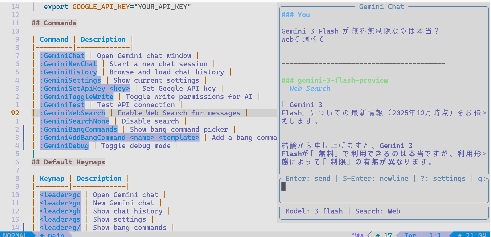

# Gemini Helper for Neovim

[](https://github.com/takeshy/nvim-gemini-helper)

Google Gemini AIをNeovimで使うためのプラグインです。RAG（File Search）機能も搭載しています。Obsidian Gemini HelperプラグインのLua移植版です。



## 機能

- **ストリーミングチャット**: Gemini APIでリアルタイム応答
- **CLIプロバイダー対応**: Gemini CLI、Claude CLI、Codex CLIを代替バックエンドとして使用可能
- **Function Calling**: AIがワークスペースを直接操作（9種類のツール）
- **複数モデル対応**: Gemini 3 Flash/Pro Preview、2.5 Flash Lite、CLIモデル
- **Web Search**: Google検索で最新情報を取得
- **Bangコマンド**: `!コマンド名`で呼び出せるカスタムコマンドテンプレート
- **ファイル添付**: 画像やテキストファイルの添付
- **チャット履歴**: 会話をMarkdownファイルで自動保存
- **セマンティック検索（RAG）**: [ragujuary](https://github.com/takeshy/ragujuary)で管理されたストアを使った意味検索
- **Safe Editing**: 提案→確認→適用の安全な編集ワークフロー
- **ローカル検索**: ファイル名・コンテンツ検索（関連度スコア付き）
- **応答自動コピー**: AI応答を自動的に`*`レジスタにコピー

## 必要条件

- Neovim 0.8以上
- [plenary.nvim](https://github.com/nvim-lua/plenary.nvim)
- Google AI APIキー

## インストール

### lazy.nvim

```lua
{
  "takeshy/nvim-gemini-helper",
  dependencies = {
    "nvim-lua/plenary.nvim",
  },
  config = function()
    require("gemini_helper").setup({
      api_key = vim.env.GOOGLE_API_KEY, -- または :GeminiSetApiKey で設定
      model = "gemini-3-flash-preview", -- デフォルトモデル
      workspace = vim.fn.getcwd(),
      allow_write = false, -- ファイル編集を許可する場合はtrue
      search_setting = nil, -- nil, "__websearch__", ストア名、または配列
    })
  end,
}
```

### packer.nvim

```lua
use {
  "takeshy/nvim-gemini-helper",
  requires = { "nvim-lua/plenary.nvim" },
  config = function()
    require("gemini_helper").setup({
      api_key = vim.env.GOOGLE_API_KEY,
    })
  end,
}
```

## セットアップ

1. [Google AI Studio](https://aistudio.google.com/) でAPIキーを取得

2. APIキーを設定:
   ```vim
   :GeminiSetApiKey YOUR_API_KEY
   ```

   または設定ファイルで:
   ```lua
   require("gemini_helper").setup({
     api_key = "YOUR_API_KEY",
   })
   ```

   または環境変数で:
   ```bash
   export GOOGLE_API_KEY="YOUR_API_KEY"
   ```

## コマンド一覧

| コマンド | 説明 |
|---------|------|
| `:GeminiChat` | チャットウィンドウを開く |
| `:GeminiNewChat` | 新しいチャットを開始 |
| `:GeminiHistory` | チャット履歴を表示・選択 |
| `:GeminiSettings` | 現在の設定を表示 |
| `:GeminiSetApiKey <key>` | APIキーを設定 |
| `:GeminiToggleWrite` | 書き込み権限を切り替え |
| `:GeminiTest` | API接続テスト |
| `:GeminiWebSearch` | Web検索を有効化 |
| `:GeminiSearchNone` | 検索を無効化 |
| `:GeminiBangCommands` | Bangコマンドピッカーを表示 |
| `:GeminiAddBangCommand <名前> <テンプレート>` | Bangコマンドを追加 |
| `:GeminiDebug` | デバッグモードを切り替え |
| `:GeminiSetApiPlan <paid\|free>` | APIプランを設定（利用可能モデルに影響） |
| `:GeminiVerifyGeminiCli` | Gemini CLIのインストールを検証 |
| `:GeminiVerifyClaudeCli` | Claude CLIのインストールを検証 |
| `:GeminiVerifyCodexCli` | Codex CLIのインストールを検証 |

## デフォルトキーマップ

| キーマップ | 説明 |
|-----------|------|
| `<leader>gc` | チャットを開く |
| `<leader>gn` | 新規チャット |
| `<leader>gh` | 履歴を表示 |
| `<leader>gs` | 設定を表示 |
| `<leader>g/` | Bangコマンドを表示 |
| `<leader>gc` (ビジュアル) | 選択テキストと共にチャットを開く |
| `<C-\>` | チャットウィンドウの表示/非表示を切り替え |

### チャットウィンドウ内

| キーマップ | 説明 |
|-----------|------|
| `<Enter>` (ノーマル) | メッセージ送信 |
| `<Enter>` (インサート) | 改行挿入 / 補完確定 |
| `<C-s>` | メッセージ送信（両モード） |
| `<Tab>` | 次の補完候補 |
| `<S-Tab>` | 前の補完候補 |
| `!` | Bangコマンド補完を開始（1行目の先頭で） |
| `?` | 設定モーダルを開く（1行目の先頭で） |
| `<C-u>` | 応答エリアを上にスクロール（半ページ） |
| `<C-d>` | 応答エリアを下にスクロール（半ページ） |
| `<C-\>` | チャットを閉じる |
| `<C-c>` | 生成を停止 |
| `<C-q>` | 閉じる（インサートモード） |
| `q` または `<Esc>` | 閉じる（ノーマルモード） |

### 入力エリア

- デフォルト高さ: 2行
- 内容に応じて最大10行まで自動拡張
- 選択テキスト付きで開くと、先頭に空行が追加される（`!`コマンド用）
- 入力欄の下に設定バーが表示され、現在のモデルと検索設定が確認できる（上書き時は`*`マーク付き）
- 1行目の先頭で`?`を入力すると設定モーダルが開く

### 設定モーダル（`?`）

1行目の先頭で`?`を押すと設定モーダルが開きます：

1. **モデル選択**: 利用可能なモデルから選択（APIプランに基づく）
2. **検索設定**:
   - Off（すべてクリア）
   - Web Search（RAGとは排他）
   - 現在のRAGストア（有効な場合は`[x]`で表示）
   - RAGストア変更（利用可能なストアから選択または手動入力）
3. **ツールモード**: モデル/検索設定に応じて自動設定、手動上書き可能
   - `all`: 全ツール利用可能
   - `noSearch`: 検索ツール除外（RAGが検索を担当）
   - `none`: ツールなし（CLIモデル、Web Search、Gemmaモデル）

モーダルで変更した設定はNeovim終了まで保持されます。Web SearchとRAGは排他的です。

## 設定オプション

```lua
require("gemini_helper").setup({
  -- API設定
  api_key = "",  -- Google AI APIキー（必須）
  api_plan = "paid",  -- "paid" または "free"（利用可能なモデルに影響）
  model = "gemini-3-flash-preview",  -- 使用するモデル

  -- ワークスペース
  workspace = vim.fn.getcwd(),  -- ファイル操作のルートディレクトリ

  -- チャット
  chats_folder = vim.fn.stdpath("data") .. "/gemini_helper/chats",
  system_prompt = "",  -- カスタムシステムプロンプト

  -- 権限
  allow_write = false,  -- AIによるファイル編集を許可

  -- 検索設定（RAGストアもここで指定）
  search_setting = nil,  -- nil=なし、"__websearch__"=Web検索、ストア名、または配列

  -- Bangコマンド
  commands = {},  -- カスタムコマンドテンプレート

  -- UI
  chat_width = 80,  -- チャットウィンドウの幅
  chat_height = 20,  -- チャットウィンドウの高さ

  -- 自動コピー
  auto_copy_response = true,  -- AI応答を*レジスタに自動コピー

  -- デバッグ
  debug_mode = false,
})
```

## ツールモード

プラグインは設定に応じて利用可能なツールを自動調整します：

| モード | 利用可能なツール | 有効になる条件 |
|--------|----------------|---------------|
| `all` | 全ツール（read + write許可時はwrite） | デフォルト |
| `noSearch` | search_notes, list_notes, list_folders を除外 | RAG有効時（RAGが検索を担当） |
| `off` | ツールなし | CLIモデル、Web Search、Gemmaモデル使用時 |

設定バーに現在のツールモードが表示されます：`Tools:all`、`Tools:noSearch`、`Tools:off`

## 利用可能なツール

AIがワークスペースと対話するために使用できるツールです。

### 読み取り操作（常に利用可能）

| ツール | 説明 |
|--------|------|
| `read_note` | ファイルの内容を読み取る |
| `search_notes` | ファイル名またはコンテンツで検索 |
| `list_notes` | フォルダ内のファイル一覧 |
| `list_folders` | すべてのフォルダ一覧 |
| `get_active_note_info` | 現在のバッファの情報を取得 |

### 書き込み操作（`allow_write = true` が必要）

| ツール | 説明 |
|--------|------|
| `create_note` | 新しいファイルを作成 |
| `create_folder` | 新しいフォルダを作成 |
| `rename_note` | ファイルの名前変更/移動 |
| `update_note` | ノートの内容を更新 |
| `write_to_buffer` | 現在のバッファに直接書き込み（未保存バッファも対応） |

## Web Search

Web検索を有効にすると、AIがインターネットから最新情報を取得できます。

```vim
:GeminiWebSearch
```

有効にすると、AIは応答する前にGoogle検索で関連情報を探します。

**注意**: Web SearchとRAG（セマンティック検索）は排他的です。一方を有効にすると他方は無効になります。Web SearchはFunction Callingツールも無効にします。

## Bangコマンド

`!コマンド名`で素早く呼び出せるカスタムコマンドテンプレートを作成できます。

### Bangコマンドの追加

コマンドで追加:
```vim
:GeminiAddBangCommand translate 以下を英語に翻訳して:
```

設定ファイルで追加:
```lua
require("gemini_helper").setup({
  commands = {
    {
      name = "translate",
      prompt_template = "以下を英語に翻訳して:",
      description = "英語に翻訳",
    },
    {
      name = "explain",
      prompt_template = "このコードを説明して:",
      description = "コードを説明",
      model = "gemini-3-pro-preview",  -- このコマンド用にモデルを変更
    },
    {
      name = "search",
      prompt_template = "以下について調べて:",
      description = "Web検索",
      search_setting = "__websearch__",  -- Web検索を有効化
    },
    {
      name = "docs",
      prompt_template = "関連ドキュメントを検索:",
      description = "複数RAGストアで検索",
      search_setting = { "docs-store", "api-store" },  -- 複数RAGストア
    },
  },
})
```

### Bangコマンドの使用方法

1. ビジュアルモードでテキストを選択（任意）
2. `<leader>gc`でチャットを開く
3. 1行目の先頭で`!`を入力して補完を開始
4. `Tab`/`Shift-Tab`で候補を選択、`Enter`で確定
5. コマンドの`prompt_template`が`!コマンド名`を置き換え
6. 選択テキスト（あれば）がその下にコンテキストとして表示

またはピッカーを使用: `<leader>g/` または `:GeminiBangCommands`

## セマンティック検索（RAG）

セマンティック検索を使用すると、AIがファイルから意味的に関連するコンテキストを取得できます。Google File Search APIを使用します。

**注意**: RAGとWeb Searchは排他的です。RAGストアかWeb Searchのどちらか一方のみ使用できます。

### セマンティック検索のセットアップ

1. [ragujuary](https://github.com/takeshy/ragujuary) CLIツールをインストール

2. ragujuaryでFile Searchストアを作成・管理:
   ```bash
   ragujuary upload ./docs -s my-store
   ```

3. プラグインにストア名を設定:
   ```lua
   require("gemini_helper").setup({
     search_setting = "my-store",  -- 単一ストア
     -- または複数: search_setting = { "docs-store", "api-store" }
   })
   ```

または設定モーダル（チャットで`?`）を使って動的にRAGストアを設定できます（カンマ区切りで複数指定可）。

### 仕組み

- ファイルの管理（アップロード、同期、削除）はragujuaryで行う
- このプラグインはチャット時にストアを使ってセマンティック検索を実行
- AIが質問に答える際にストアから関連コンテキストを取得
- 対応フォーマット: .txt, .md, .pdf, .doc, .docx, コードファイルなど

### セマンティック検索の使用例

AIに聞くことができます：
- 「このプロジェクトについて教えて」（関連ファイルを検索）
- 「ドキュメントからXXXについて調べて」
- 「コードベースでYYYはどう実装されている？」

## チャット履歴

チャット履歴は`~/.local/share/nvim/gemini_helper/chats/`にMarkdownファイルとして保存されます。

形式:
```markdown
---
title: "チャットのタイトル..."
createdAt: 1702841234567
updatedAt: 1702841240000
---

# チャットのタイトル...

*Created: 2024-01-01 12:00*

---

## **You** (12:00:00)

あなたのメッセージ...

---

## **Gemini** (12:00:05)

> Tools: read_note, search_notes

AIの応答...

---
```

## 利用可能なモデル

### Paid プランモデル

| モデル | 説明 |
|--------|------|
| `gemini-3-flash-preview` | 最新の高速モデル、1Mコンテキスト（デフォルト、推奨） |
| `gemini-3-pro-preview` | 最新のフラッグシップモデル、1Mコンテキスト、最高性能 |
| `gemini-2.5-flash-lite` | 軽量フラッシュモデル |

### Free プランモデル

| モデル | 説明 |
|--------|------|
| `gemini-2.5-flash` | 無料枠の高速モデル |
| `gemini-2.5-flash-lite` | 無料枠の軽量モデル |
| `gemini-3-flash-preview` | 無料枠のプレビューモデル |
| `gemma-3-27b-it` | Gemma 3 27B（Function Calling非対応） |
| `gemma-3-12b-it` | Gemma 3 12B（Function Calling非対応） |
| `gemma-3-4b-it` | Gemma 3 4B（Function Calling非対応） |

### CLIモデル

CLIモデルは対応するCLIツールのインストールと検証が必要です。

| モデル | 説明 |
|--------|------|
| `gemini-cli` | コマンドライン経由のGoogle Gemini（Googleアカウントが必要） |
| `claude-cli` | コマンドライン経由のAnthropic Claude（Anthropicアカウントが必要） |
| `codex-cli` | コマンドライン経由のOpenAI Codex（OpenAIアカウントが必要） |

## CLIプロバイダー

APIキー不要でCLIベースのAIバックエンドを使用できます。CLIモデルはセッション再開（Claude/Codex）をサポートし、会話コンテキストを維持できます。

### セットアップ

1. CLIツールをインストール:
   ```bash
   # Gemini CLI
   npm install -g @google/gemini-cli

   # Claude CLI
   npm install -g @anthropic-ai/claude-code

   # Codex CLI
   npm install -g @openai/codex
   ```

2. インストールを検証:
   ```vim
   :GeminiVerifyClaudeCli
   ```

3. 設定モーダル（チャットで`?`）でCLIモデルを選択

### 注意事項

- CLIモデルはWeb SearchやRAGをサポートしていません
- Claude CLIとCodex CLIはセッション再開をサポート
- APIキー不要（CLI認証を使用）
- 検証済みCLIモデルはモデル選択に表示されます

## 設定ファイル

設定は自動的に以下に保存されます：
```
~/.local/share/nvim/gemini_helper/settings.json
```

## トラブルシューティング

### APIキーエラー
```
Please set your Google API key first with :GeminiSetApiKey
```
→ `:GeminiSetApiKey YOUR_API_KEY` でAPIキーを設定

### plenary.nvimが見つからない
```
gemini_helper requires plenary.nvim
```
→ plenary.nvimをインストール

### RAGが動作しない
- ragujuaryでストアが正しく作成されているか確認
- `search_setting`にストア名が正しく設定されているか確認
- Web Searchが有効になっていないか確認（RAGとWeb Searchは排他的）

## ライセンス

MIT

## クレジット

[obsidian-gemini-helper](https://github.com/your-username/obsidian-gemini-helper) をベースにしています。
